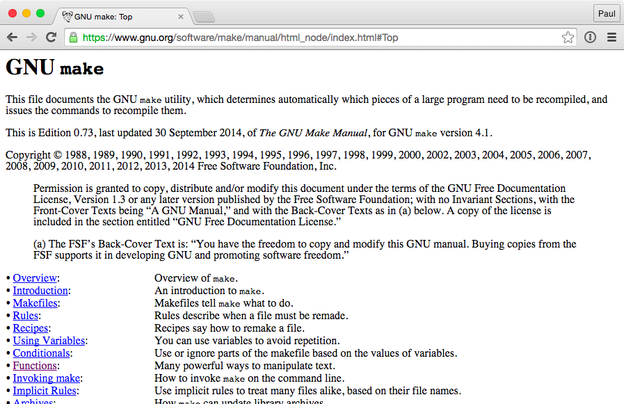
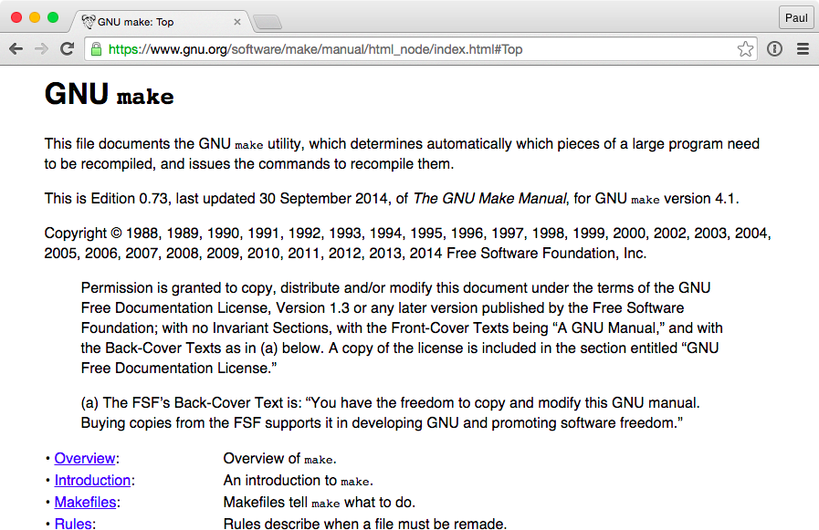

# Prettier Online Unix Manualss 
This Chrome extension applies a basic stylesheet to manual pages on the 
[Linux Documentation Project](http://tldp.org/) and [GNU's manual pages](https://www.gnu.org/)

Turning this:

Into this:

## Installation
1. Download the `*.crx` file from the [latest release](https://github.com/8bitDesigner/better-unix-manuals/releases)
2. Open [chrome://extensions](chrome://extensions)
3. Drag the `*.crx` file you just downloaded onto the page.

